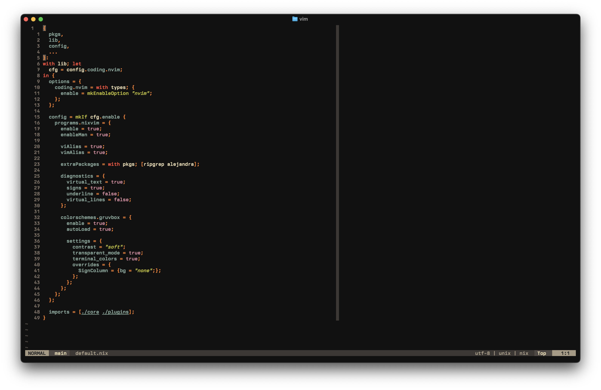

# DOTFILES
Welcome to my dotfiles! I use nix-darwin and home-manager to manage my macOS system configuration 
declaratively. With Nix, I ensure a reproducible and portable setup, making it easy to sync my 
environment across machines effortlessly.

These dotfiles contain my personal Nix modules, shell configurations, and system settings, all 
structured for maintainability and customization.

## Zsh
<picture>
  
</picture>

## Nvim
<picture>
  
</picture>
